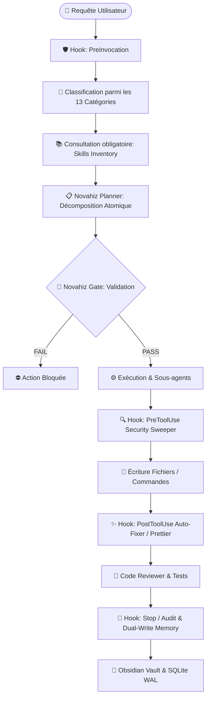

# ⚡ NOVAHIZ — SPÉCIFICATION UNIVERSELLE DU WORKFLOW AGENT

> **Guide d'Ingénierie Système et Architecture d'Exécution pour Assistants IA Autonomes**  
> Compatible avec : **Claude Code**, **OpenAI Codex**, **OpenCode**, **Google Antigravity**, **Cursor**, **Windsurf**.

---

## 1. Philosophie et Principes Fondateurs

Le système **Novahiz** repose sur un principe fondamental :

> **ZÉRO SIMULATION — LES RÈGLES SONT ENFORCÉES PAR DES HOOKS ET DES INTERCEPTEURS SYSTÈME, JAMAIS PAR SIMPLE CONSIGNE TEXTUELLE.**

Dans un environnement agentique classique, les modèles de langage peuvent "oublier" leurs consignes système, sauter des étapes de vérification ou écrire du code à l'aveugle sans plan préalable.  
Novahiz transforme un assistant conversationnel en une **machine de production logicielle déterministe, sécurisée et auditable**.



---

## 2. La Matrice des 13 Catégories de Requêtes

Chaque demande entrant dans le système doit être classée immédiatement dans l'une des 13 catégories ci-dessous. Chaque catégorie applique une **politique d'outils stricts** (outils autorisés vs outils strictement bloqués avant passage du Gate) :

| #      | Catégorie      | Description                                 | Outils Bloqués avant Gate                              | Livrable Attendu                       |
| ------ | -------------- | ------------------------------------------- | ------------------------------------------------------ | -------------------------------------- |
| **01** | `feature`      | Nouvelle fonctionnalité logicielle          | `write_to_file`, `replace_file_content`, `run_command` | Code + Tests + Review                  |
| **02** | `bugfix`       | Correction d'un bug ou régression           | `write_to_file`, `replace_file_content`                | Root Cause + Fix ciblé + Test          |
| **03** | `refactor`     | Refactorisation sans changement fonctionnel | `write_to_file`, `replace_file_content`                | Code propre + Non-régression           |
| **04** | `architecture` | Conception système, ADR, schéma de données  | Écriture de code direct                                | ADR Markdown / Schéma Mermaid          |
| **05** | `security`     | Audit de vulnérabilités, SAST, secrets      | Modifications non autorisées                           | Rapport de conformité / Correctif      |
| **06** | `devops_ci`    | Pipelines CI/CD, Docker, Workflows          | Commandes destructives                                 | Manifestes validés                     |
| **07** | `testing`      | Création de suites de tests (Unit/E2E)      | Modification du code applicatif                        | Tests verts (Playwright, Jest, Pytest) |
| **08** | `docs`         | Documentation technique, README, OpenAPI    | Modifications de logique métier                        | Fichiers Markdown / JSDoc              |
| **09** | `mobile_expo`  | Écosystème Expo / React Native              | Éditions sans typage strict                            | Composants natifs + HIG Apple          |
| **10** | `web_ui`       | Interface web, Next.js, Design Impeccable   | Styles génériques / Tailwind v3 obsolète               | UI responsive, dark-mode, tokens       |
| **11** | `database`     | Modélisation Prisma, SQL, Migrations        | Commandes `DROP` ou migrations à chaud                 | Schémas validés + Requêtes optimisées  |
| **12** | `config`       | Configuration d'outils, MCP, IDE, Linters   | Écriture hors dossier de conf                          | Configurations JSON/YAML valides       |
| **13** | `research`     | Recherche exploratoire, veille technique    | Toute écriture (`write_to_file`, etc.)                 | Synthèse textuelle claire              |

---

## 3. Le Système de "Gate" et d'Interception Pré-Exécution

### 3.1. Le Gate

Le **Gate** est le verrou central de sécurité. Aucun outil d'écriture ou d'exécution majeure ne peut être appelé tant que les conditions suivantes ne sont pas remplies :

1. La catégorie a été identifiée.
2. L'inventaire des compétences correspondantes (`skills_inventory/`) a été consulté.
3. Un plan atomique (Todo list avec statuts `PENDING`, `IN_PROGRESS`, `DONE`) a été créé.
4. L'outil MCP `novahiz_gate` a validé le passage à l'état `PASS`.

### 3.2. Le Security Sweeper (`PreToolUse`)

Intercepteur automatique qui analyse en temps réel le contenu textuel transmis à `write_to_file` ou `replace_file_content` via des expressions régulières pour interdire toute fuite de secrets :

- Clés AWS (`AKIA[0-9A-Z]{16}`)
- Tokens OpenAI (`sk-[a-zA-Z0-9]{32,}`)
- GitHub Personal Access Tokens (`ghp_[a-zA-Z0-9]{36}`)
- Clés API Anthropic (`sk-ant-[a-zA-Z0-9-_]{32,}`)
- Clés Privées RSA/OpenSSH (`-----BEGIN (RSA|EC|OPENSSH) PRIVATE KEY-----`)

### 3.3. L'Auto-Fixer (`PostToolUse`)

Après chaque écriture réussie de fichier TypeScript, JavaScript, CSS, JSON ou HTML, un hook d'arrière-plan exécute automatiquement un formateur (Prettier) pour garantir une conformité syntaxique irréprochable sans intervention humaine.

---

## 4. Base de Données SQLite WAL & Télémétrie Temps Réel

Le système conserve l'historique complet de conformité dans une base de données **SQLite locale configurée en mode WAL (Write-Ahead Logging)** pour permettre des lectures et écritures simultanées ultra-rapides.

### Schéma Relationnel (`novahiz.db`) :

```sql
PRAGMA journal_mode = WAL;
PRAGMA busy_timeout = 5000;

-- 1. Table des événements de conformité
CREATE TABLE IF NOT EXISTS compliance_log (
    id INTEGER PRIMARY KEY AUTOINCREMENT,
    session_id TEXT NOT NULL,
    rule_name TEXT NOT NULL,
    category TEXT NOT NULL,
    status TEXT CHECK(status IN ('PASS', 'BLOCKED', 'WARNING', 'INFO')),
    details TEXT,
    timestamp DATETIME DEFAULT CURRENT_TIMESTAMP
);

-- 2. Table des sessions agentiques
CREATE TABLE IF NOT EXISTS sessions (
    id TEXT PRIMARY KEY,
    start_time DATETIME DEFAULT CURRENT_TIMESTAMP,
    end_time DATETIME,
    primary_category TEXT,
    skills_invoked TEXT, -- Tableau JSON
    tools_used_count INTEGER DEFAULT 0,
    security_alerts_count INTEGER DEFAULT 0,
    obsidian_synced BOOLEAN DEFAULT 0
);

-- 3. Table des tâches atomiques (Todos)
CREATE TABLE IF NOT EXISTS todos (
    id INTEGER PRIMARY KEY AUTOINCREMENT,
    session_id TEXT NOT NULL,
    title TEXT NOT NULL,
    status TEXT CHECK(status IN ('PENDING', 'IN_PROGRESS', 'DONE', 'CANCELLED')),
    created_at DATETIME DEFAULT CURRENT_TIMESTAMP,
    completed_at DATETIME
);

-- 4. Buffer de mémoire
CREATE TABLE IF NOT EXISTS memory_buffer (
    id INTEGER PRIMARY KEY AUTOINCREMENT,
    key TEXT UNIQUE NOT NULL,
    value TEXT NOT NULL,
    updated_at DATETIME DEFAULT CURRENT_TIMESTAMP
);
```

---

## 5. Dashboard Live Dynamique (Next.js 14 + Recharts)

Novahiz intègre une console de supervision en temps réel construite en **Next.js 14 (App Router) avec Tailwind CSS et Recharts** :

- **KPI Cards** : Taux de conformité Gate (%), Nombre de sessions totales, Alertes de sécurité bloquées, Outils invoqués.
- **Graphique Radar & Barres** : Répartition des 13 catégories traitées.
- **Flux de Télémétrie en Direct** : Table des logs SQLite avec rafraîchissement dynamique (polling 3s).
- **Auto-Starter** : Lancé automatiquement dès l'ouverture de l'agent sur le port `3456`.

---

## 6. Mémoire Dual-Write (Obsidian + Local)

À la fin de chaque session de travail (événement `Stop` ou audit final) :

1. **Mémoire Projet Locale** : Mise à jour du fichier `MEMORY.md` à la racine du projet avec les décisions d'architecture et les choix techniques.
2. **Coffre Obsidian** : Création automatique d'une note Markdown formatée dans le vault Obsidian (`Novahiz-Sessions/Session-<ID>.md`) avec YAML Frontmatter complet (tags, métriques, skills utilisés, résumé des tâches).

---

## 7. Adaptation Native aux Différents "Harnesses" IA

Chaque environnement d'exécution IA dispose de son propre système d'extension. **Le harness cible doit générer les plugins et scripts selon ses propres standards :**

- **Google Antigravity** : Plugins déclarés dans `plugin.json` + `hooks.json` exécutant des scripts TypeScript pré-compilés par `esbuild` sur les événements `PreToolUse`, `PostToolUse`, `PreInvocation`, `Stop`.
- **Claude Code** : Hooks configurés dans `~/.claude/settings.json` ou plugins slash commands.
- **OpenCode / Codex** : Configuration dans `mcp_config.json` et scripts Python/Node.js en sidecars d'exécution.
- **Cursor / Windsurf** : Règles `.cursorrules` / `.windsurfrules` associées aux serveurs MCP locaux.
