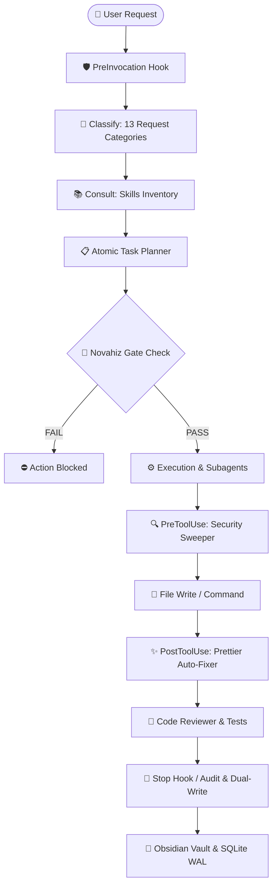

# ⚡ Novahiz — The Deterministic AI Agent Engine & Workflow Enforcer

[](LICENSE)
[](<>)
[](<>)
[](<>)

> **Zero Simulation. 100% Deterministic Execution.**  
> Novahiz is an enterprise-grade agent orchestration framework that turns autonomous AI coding assistants into reliable, secure, and auditable production engines with native pre/post-tool enforcement hooks, real-time secret detection, and dual-write memory persistence.

---

## 🌟 Nouvelle Architecture v2

Nous avons repensé le moteur pour le rendre encore plus rapide et autonome :
- **Fast-Track & Zero-Markdown** : Abandon de la lecture lente des fichiers `.md` pour l'inventaire. L'agent utilise désormais un serveur MCP natif (`novahiz_list_skills`) pour instantanément connaître toutes ses capacités.
- **Contrôle Full ADB (Android)** : Refus des serveurs MCP lents pour l'émulateur. L'agent utilise `adb shell` et `exec-out` pour faire des clics instantanés, du swipe et extraire l'arbre UI (XML) en quelques millisecondes, sans recours à l'analyse d'image.
- **Auto Hot-Reloading** : Désormais, chaque modification d'un fichier React Native/Expo déclenche un `adb shell input text "rr"` automatique. Le code se rafraîchit en temps réel sur l'émulateur sans aucune action requise.
- **Mémoire de Projet (Project Brain)** : Finie la perte de contexte ! À la fin de chaque tâche complexe, le système rédige et lit un fichier `MEMORY.md` synchronisé avec Obsidian pour reprendre l'état d'esprit exact du projet d'une session à l'autre.

## 🚀 Quickstart: 1-Click Interactive Installer

The installer automatically detects your operating system, identifies installed AI coding environments, and prompts you to select where you want Novahiz installed:

### 🍏 macOS & 🐧 Linux

```bash
curl -fsSL https://raw.githubusercontent.com/novahiz/novahiz/main/install.sh | bash
```

### 🪟 Windows (PowerShell)

```powershell
irm https://raw.githubusercontent.com/novahiz/novahiz/main/install.ps1 | iex
```

### 🎯 Interactive Installer Preview:

```text
🔍 Détection automatique de vos environnements IA...

🎯 Veuillez choisir l'assistant IA dans lequel installer Novahiz :

  [1] Google Antigravity        [DÉTECTÉ]
  [2] Claude Code               [DÉTECTÉ]
  [3] OpenCode / Codex          [Disponible]
  [4] Cursor IDE (.cursorrules) [DÉTECTÉ]
  [5] 🌟 Installer dans TOUS les environnements détectés
  [6] 📁 Choisir un répertoire personnalisé
  [0] ❌ Quitter

Entrez votre choix (1-6): 1
🚀 Installation de Novahiz dans : Google Antigravity -> C:\Users\...\.gemini\config
  📦 Déploiement des 153 skills...
  ⚙️ Application de l'adaptateur antigravity...
  🗄️ Initialisation de la base SQLite WAL...
  ✅ Installation terminée avec succès !
```

---

## 🏗️ Architecture & Execution Pipeline



---

## 📊 The 13 Request Categories Matrix

| #      | Category       | Core Purpose            | Enforced Gate Policy               | Expected Deliverable            |
| ------ | -------------- | ----------------------- | ---------------------------------- | ------------------------------- |
| **01** | `feature`      | New software feature    | Blocks writes until plan validated | Code + Tests + Review           |
| **02** | `bugfix`       | Root cause repair       | Blocks blind modifications         | RCA + Targeted Fix + Test       |
| **03** | `refactor`     | Clean code refactoring  | Requires non-regression tests      | Clean Code + Zero logic change  |
| **04** | `architecture` | System & Data Design    | Disallows premature coding         | ADR Markdown / Mermaid Diagram  |
| **05** | `security`     | SAST & CVE Audits       | Disallows unmonitored commands     | Compliance & Security Report    |
| **06** | `devops_ci`    | CI/CD & Containers      | Prevents destructive commands      | Validated Docker/K8s/CI configs |
| **07** | `testing`      | Unit & E2E Suites       | Blocks edits to business logic     | Green tests (Playwright, Jest)  |
| **08** | `docs`         | Technical Documentation | Protects application code          | Clean Markdown / OpenAPI Specs  |
| **09** | `mobile_expo`  | React Native & Expo     | Enforces strict typing & Apple HIG | Native screens & smooth motion  |
| **10** | `web_ui`       | Next.js & Web UI        | Blocks generic AI design patterns  | Impeccable dark-mode UI         |
| **11** | `database`     | Prisma & SQL Migrations | Forbids unindexed queries & DROP   | Optimized schema & queries      |
| **12** | `config`       | Tooling & MCP setup     | Isolates config changes            | Validated JSON/YAML             |
| **13** | `research`     | Exploration & Docs      | Read-only tools only               | Structured tech summary         |

---

## 📦 What's Included in this Repository

- **`skills/`** : 153 curated, production-grade agent skills (React 19, Next.js 15, Tailwind v4, Expo, Node.js, Python 3.11+, Playwright Pro, Clean Code).
- **`skills_inventory/`** : Modular categorized index for instant skill discovery.
- **`adapters/`** : Native bindings for **Google Antigravity**, **Claude Code**, **OpenCode**, and **Cursor**.
- **`mcp/`** : Universal Model Context Protocol server templates.
- **`reference_scripts/`** : High-performance Python SQLite WAL telemetry & analytics engine.
- **`reference_dashboard/`** : Lightweight Next.js 14 real-time telemetry dashboard (Recharts, Glassmorphic dark mode).

---

## 🚀 How to Publish to GitHub in 3 Steps

1. **Initialize Git in this directory**:
   ```bash
   git init
   git add .
   git commit -m "feat: initial release of Novahiz universal agent workflow"
   ```
2. **Create a new repository on GitHub** (e.g. `https://github.com/<your-username>/novahiz`).
3. **Link and Push**:
   ```bash
   git branch -M main
   git remote add origin https://github.com/novahiz/novahiz.git
   git push -u origin main
   ```

---

## 📄 License

Released under the [MIT License](LICENSE).

