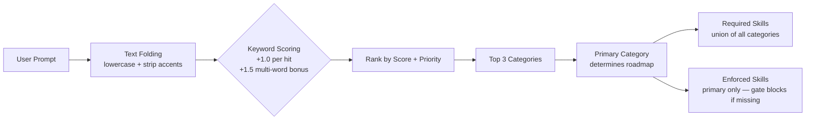
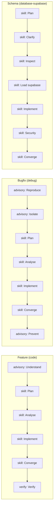
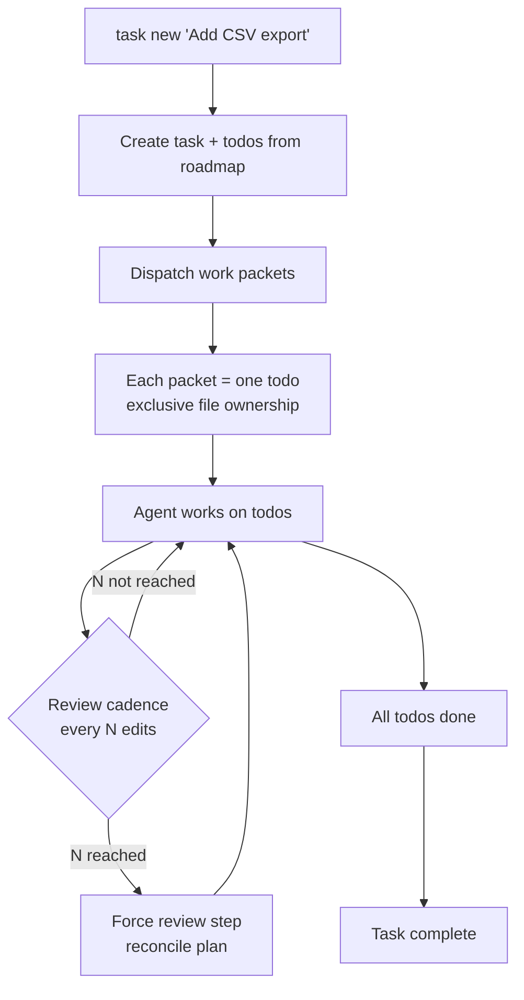

# skillenforce

> **Zero-dependency enforcement layer for AI coding agents** — classifies prompts, assigns execution roadmaps, blocks unsafe edits, and injects session-level skills, all deterministically without model calls.

14 categories, 173+ skills, 7 gate rules, 12 MCP providers — all deterministic, all local, all JSON.

```
┌─────────────────────────────────────────────────────────────────────┐
│                                                                     │
│    USER PROMPT  ──▶  CLASSIFIER  ──▶  GATE  ──▶  SAFE OUTPUT      │
│                                                                     │
│    "Fix the      3 categories    2 missing     Edit blocked        │
│     auth bug"    detected         skills        until skills       │
│                                   required      loaded             │
│                                                                     │
└─────────────────────────────────────────────────────────────────────┘
```

---

## What it does

```
┌──────────────────────────────────────────────────────────────────────────┐
│                        HOW SKILLENFORCE WORKS                            │
│                                                                          │
│  ┌──────────┐    ┌────────────┐    ┌──────────┐    ┌──────────────┐     │
│  │  USER    │───▶│  CLASSIFY  │───▶│  INJECT  │───▶│    MODEL     │     │
│  │  PROMPT  │    │            │    │ ENFORCE  │    │   RESPONSE   │     │
│  └──────────┘    │ keywords   │    │ block +  │    └──────┬───────┘     │
│                  │ priority   │    │ roadmap  │           │             │
│                  │ roadmap    │    │ ledger   │           ▼             │
│                  └────────────┘    └──────────┘    ┌──────────────┐     │
│                       │                            │  TOOL CALL   │     │
│                       │                            │ (edit/write) │     │
│                       │                            └──────┬───────┘     │
│                       │                                   │             │
│                       │         ┌────────────┐            │             │
│                       └────────▶│    GATE    │◀───────────┘             │
│                                 │            │                          │
│                                 │  file path │                          │
│                                 │  skills    │                          │
│                                 │  content   │                          │
│                                 └─────┬──────┘                          │
│                                       │                                 │
│                                       ▼                                 │
│                                 ┌──────────┐                           │
│                                 │ allow /  │                           │
│                                 │ BLOCK    │                           │
│                                 └──────────┘                           │
│                                                                          │
└──────────────────────────────────────────────────────────────────────────┘
```

**14 categories**, **173+ skills**, **6 gate rules**, **12 MCP providers** — all deterministic, all local, all JSON.

---

## Quick start

### Option 1 — One-liner (recommended)

```bash
npm install -g skillenforce
```

This installs skillenforce globally and auto-configures opencode (skills, plugin, MCP servers, config). Then verify:

```bash
npx skillenforce doctor   # 10 health checks
npx skillenforce classify "fix the auth bug"
```

### Option 2 — From source

```bash
git clone https://github.com/novahiz/skillenforce.git
cd novahiz
npm install && npm run build
node ./install/install.mjs

# Verify
npx skillenforce doctor
```

> Requires **Node.js >= 22.18**. The installer auto-installs opencode if it's missing.

---

## The Classifier

Every user prompt passes through the classifier. It scores keywords against 14 categories and picks the top matches.



**Example:**

| Prompt | Top Category | Confidence | Skills Required |
|--------|-------------|------------|-----------------|
| "fix the auth bug" | `debug` | 0.60 | skillenforce-plan, skillenforce-analyse, skillenforce-implement, skillenforce-converge |
| "add a landing page" | `design-ui` | 0.50 | impeccable, humanizer |
| "create supabase migration" | `database-supabase` | 0.60 | supabase, supabase-postgres-best-practices, skillenforce-plan, skillenforce-implement |

---

## The Gate

The gate is the enforcement mechanism. It inspects every file edit and decides: **allow** or **block**.

```mermaid
flowchart TD
    A[Tool Call: edit / write / patch] --> B[File Class Detection]
    B --> C{Rule Matching}
    
    C --> D[R1: Code contains prose?<br/>require humanizer]
    C --> E[R2: File is CSS/HTML?<br/>require impeccable]
    C --> F[R3: Prompt was Supabase?<br/>require supabase skills]
    C --> G[R4: Prompt was browser?<br/>require playwright-agent]
    C --> H[R5: Prompt was design?<br/>require impeccable]
    
    D --> I{Roadmap Enforcement}
    E --> I
    F --> I
    G --> I
    H --> I
    
    I --> J{Placeholder Detection<br/>TODO / FIXME / placeholder tokens}
    
    J --> K[Check installed skills<br/>(missing = reported, not blocked)]
    J --> L[Check loaded skills<br/>(missing = BLOCKED)]
    
    K --> M{All loaded?}
    L --> M
    
    M -->|Yes| N[✅ Allow edit]
    M -->|No| O[❌ Block edit<br/>list missing skills]
```

### File classes

| Class | Extensions |
|-------|-----------|
| `code` | `.ts`, `.tsx`, `.js`, `.jsx`, `.py`, `.go`, `.rs`, `.java`, `.kt`, `.swift`, `.php`, `.dart`, `.rb` |
| `design` | `.css`, `.scss`, `.html`, `.vue`, `.svelte`, `.astro` |
| `text` | `.md`, `.txt`, `.rst` |
| `config` | `.json`, `.yaml`, `.yml`, `.toml` |
| `data` | `.csv`, `.sql`, `.db` |

### Gate rules

| Rule | Triggers on | Requires |
|------|-------------|----------|
| R1 | Code/design file + prose content | humanizer |
| R2 | Style files (CSS/HTML) | impeccable |
| R2 | JSX/TSX + style patterns | impeccable |
| R3 | Supabase prompt category | supabase skills |
| R4 | Browser prompt category | playwright-agent |
| R5 | Design prompt category | impeccable |

---

## Roadmaps

Each category has an ordered execution roadmap. The gate enforces non-optional `skill` steps.



| Step Kind | What it means | Gate behavior |
|-----------|---------------|---------------|
| `skill` | Load a skill before proceeding | **Blocks** if skill not loaded |
| `edit` | Make code changes | Allowed |
| `verify` | Check the work is correct | Advisory |
| `advisory` | Informational | Never blocks |

---

## Task Ledger

For work that spans more than a few steps, the ledger keeps the plan in SQLite instead of in the conversation.



- **Exclusive file ownership** — no two work packets can edit the same file
- **Iteration budget** — each todo has a max (default: 12) before escalation
- **Review cadence** — forced review every 3 edits or 2 completed todos
- **Proof required** — verify steps require evidence before completion

---

## Installed skills

skillenforce ships with 173+ skills across all categories:

| Category | Skills | Purpose |
|----------|--------|---------|
| `code` | typescript-expert, clean-code, zero-hallucination-coder, senior-backend, senior-architect, ... | Code quality, patterns, architecture |
| `debug` | debug-issue, code-understand, anti-pattern-detector, ... | Root cause analysis, code navigation |
| `review` | code-reviewer, adversarial-reviewer, review-pr, ... | Structured review, blast radius |
| `database-supabase` | supabase, supabase-postgres-best-practices, database-designer, ... | Schema, RLS, migrations, optimization |
| `design-ui` | impeccable, anti-AI-design, design-taste-frontend, apple-hig-expert, ... | UI/UX, visual hierarchy, native feel |
| `docs-writing` | copywriting, copy-editing, humanizer, ... | Prose, marketing copy, AI de-tell |
| `browser` | playwright-agent, defuddle, computer-use, ... | Web automation, screenshots, extraction |
| `audit` | senior-secops, security-guidance, narsil-*, dependency-auditor, ... | Security, compliance, vulnerability |

Run `npx skillenforce skills --all` to see the full list.

---

## Providers

skillenforce auto-registers external MCP servers based on the prompt category:

| Provider | Purpose | Categories |
|----------|---------|------------|
| context7 | Library documentation | all |
| narsil | Code intelligence, security scan | code, debug, review, audit |
| defuddle | Clean markdown from URLs | research, docs-writing |
| playwright | Browser automation | browser, design |
| supabase | Database operations | database-supabase |
| supabase-postgres-best-practices | Postgres optimization | database-supabase |
| security | Security orchestration | audit |
| cron | Scheduled tasks | devops |
| dart | Dart/Flutter tools | code |

See [docs/PROVIDERS.md](docs/PROVIDERS.md) for full details.

---

## Configuration

```bash
# Disable the gate (escape hatch)
NOVAHIZ_GATE=off npx opencode

# Override home directory
NOVAHIZ_HOME=/path/to/skillenforce npx skillenforce doctor

# Force node version
NOVAHIZ_NODE=/usr/local/bin/node npx skillenforce doctor
```

See [docs/CONFIGURATION.md](docs/CONFIGURATION.md) for all options.

---

## Commands

| Command | Purpose |
|---------|---------|
| `skillenforce init` | One-shot setup |
| `skillenforce doctor` | 10-check health diagnostic |
| `skillenforce status` | Current classification + gate state |
| `skillenforce classify <text>` | Classify a prompt |
| `skillenforce gate` | Check if an edit is allowed |
| `skillenforce task new <title>` | Start a tracked task |
| `skillenforce task status` | Task progress |
| `skillenforce task done <id>` | Mark a todo complete |
| `skillenforce report` | Session report |
| `skillenforce skills` | List loaded or available skills |
| `skillenforce catalog <query>` | Search the skill catalog |
| `skillenforce roadmap` | Show execution roadmap |
| `skillenforce dispatch` | Generate work packets |
| `skillenforce sync` | Rebuild installed-skills index |
| `skillenforce clean` | Remove old logs |
| `skillenforce upgrade` | Pull latest + rebuild |
| `skillenforce version` | Print version |

See [docs/CLI.md](docs/CLI.md) for full reference.

---

## Documentation

| File | Topic |
|------|-------|
| [docs/ARCHITECTURE.md](docs/ARCHITECTURE.md) | System design, components, data flow |
| [docs/CLASSIFICATION.md](docs/CLASSIFICATION.md) | How the classifier works |
| [docs/GATE.md](docs/GATE.md) | Gate rules, file classes, enforcement |
| [docs/CATALOG.md](docs/CATALOG.md) | Categories, rules, providers, overrides |
| [docs/PLUGIN.md](docs/PLUGIN.md) | opencode plugin lifecycle |
| [docs/CLI.md](docs/CLI.md) | CLI command reference |
| [docs/CONFIGURATION.md](docs/CONFIGURATION.md) | Config files and env vars |
| [docs/EXECUTION.md](docs/EXECUTION.md) | Task ledger, todos, dispatch |
| [docs/PROVIDERS.md](docs/PROVIDERS.md) | MCP servers and skill packs |
| [docs/INSTALL.md](docs/INSTALL.md) | Installation and setup |
| [docs/ROADMAPS.md](docs/ROADMAPS.md) | Execution roadmaps |
| [docs/RULES.md](docs/RULES.md) | Gate rules reference |
| [docs/CONSTITUTION.md](docs/CONSTITUTION.md) | Project principles |
| [docs/HARNESSES.md](docs/HARNESSES.md) | Harness adapter guide |
| [docs/TOKENS.md](docs/TOKENS.md) | Token diagnostics |

---

## Philosophy

skillenforce treats skills like **locks** and the prompt like a **key**. The classifier determines which locks exist. The gate checks whether you have the right keys loaded. No key, no edit.

Everything is local, deterministic, and JSON. No cloud calls. No model inference in the decision path. Same prompt + same config = same result, every time.

---

## License

MIT
