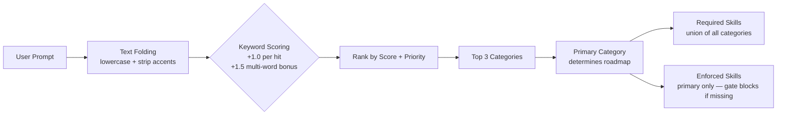
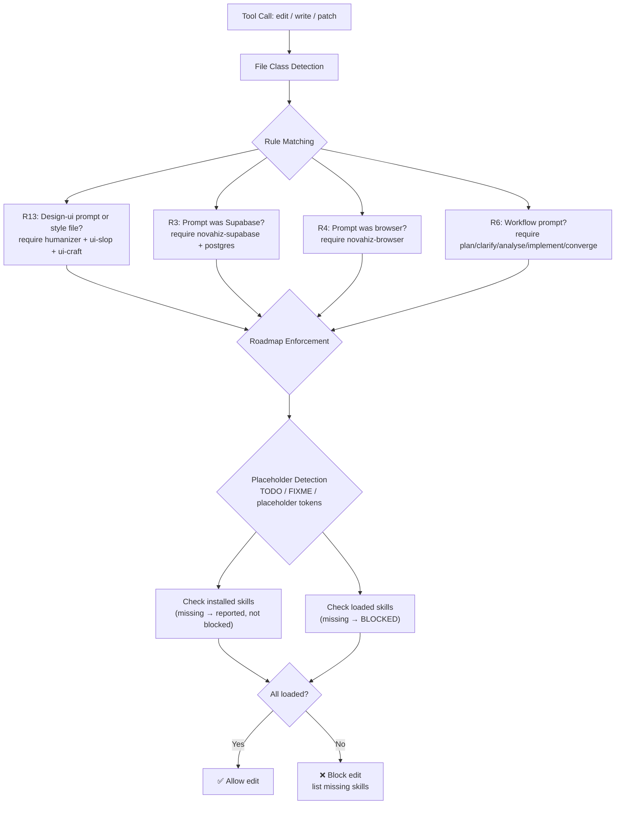
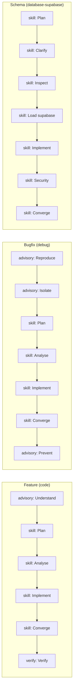
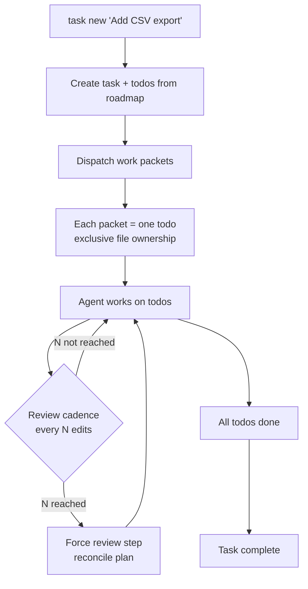

# Novahiz: Agent Governance Toolkit

> **Zero-dependency enforcement layer for AI coding agents** — classifies prompts, assigns execution roadmaps, blocks unsafe edits, and injects session-level skills, all deterministically without model calls.

16 categories, 41 skills, 10 gate rules, 7 MCP providers — all deterministic, all local, all JSON.

```
┌─────────────────────────────────────────────────────────────────────┐
│                                                                     │
│    USER PROMPT  ──▶  CLASSIFIER  ──▶  GATE  ──▶  SAFE OUTPUT      │
│                                                                     │
│    "Fix the      3 categories    2 missing     Edit blocked        │
│     auth bug"    detected         skills        until skills       │
│                                   required      loaded             │
│                                                                     │
└─────────────────────────────────────────────────────────────────────┘
```

---

## What it does

```
┌──────────────────────────────────────────────────────────────────────────┐
│                        HOW Novahiz WORKS                            │
│                                                                          │
│  ┌──────────┐    ┌────────────┐    ┌──────────┐    ┌──────────────┐     │
│  │  USER    │───▶│  CLASSIFY  │───▶│  INJECT  │───▶│    MODEL     │     │
│  │  PROMPT  │    │            │    │ ENFORCE  │    │   RESPONSE   │     │
│  └──────────┘    │ keywords   │    │ block +  │    └──────┬───────┘     │
│                  │ priority   │    │ roadmap  │           │             │
│                  │ roadmap    │    │ ledger   │           ▼             │
│                  └────────────┘    └──────────┘    ┌──────────────┐     │
│                       │                            │  TOOL CALL   │     │
│                       │                            │ (edit/write) │     │
│                       │                            └──────┬───────┘     │
│                       │                                   │             │
│                       │         ┌────────────┐            │             │
│                       └────────▶│    GATE    │◀───────────┘             │
│                                 │            │                          │
│                                 │  file path │                          │
│                                 │  skills    │                          │
│                                 │  content   │                          │
│                                 └─────┬──────┘                          │
│                                       │                                 │
│                                       ▼                                 │
│                                 ┌──────────┐                           │
│                                 │ allow /  │                           │
│                                 │ BLOCK    │                           │
│                                 └──────────┘                           │
│                                                                          │
└──────────────────────────────────────────────────────────────────────────┘
```

**16 categories**, **41 skills**, **10 gate rules**, **7 MCP providers** — all deterministic, all local, all JSON.

---

## Quick start

### Option 1 — One-liner (recommended)

```bash
npm install -g Novahiz
```

This installs Novahiz globally and auto-configures opencode (skills, plugin, MCP servers, config). Then verify:

```bash
npx Novahiz doctor   # 12 health checks
npx Novahiz classify "fix the auth bug"
```

### Option 2 — From source

```bash
git clone https://github.com/novahiz/novahiz.git
cd novahiz
npm install && npm run build
node ./install/install.mjs

# Verify
npx Novahiz doctor
```

> Requires **Node.js >= 22.18**. The installer auto-installs opencode if it's missing.

---

## The Classifier

Every user prompt passes through the classifier. It scores keywords against 16 categories and picks the top matches.



**Example:**

| Prompt | Top Category | Confidence | Skills Required |
|--------|-------------|------------|-----------------|
| "fix the auth bug" | `debug` | 0.60 | novahiz-plan, novahiz-analyse, novahiz-implement, novahiz-converge |
| "add a landing page" | `design-ui` | 0.50 | novahiz-humanizer, ui-slop-remover |
| "create supabase migration" | `database-supabase` | 0.60 | novahiz-supabase, novahiz-postgres, novahiz-plan, novahiz-implement |

---

## The Gate

The gate is the enforcement mechanism. It inspects every file edit and decides: **allow** or **block**.



### File classes

| Class | Extensions |
|-------|-----------|
| `code` | `.ts`, `.tsx`, `.js`, `.jsx`, `.py`, `.go`, `.rs`, `.java`, `.kt`, `.swift`, `.php`, `.dart`, `.rb` |
| `design` | `.css`, `.scss`, `.html`, `.vue`, `.svelte`, `.astro` |
| `text` | `.md`, `.txt`, `.rst` |
| `config` | `.json`, `.yaml`, `.yml`, `.toml` |
| `data` | `.csv`, `.sql`, `.db` |

### Gate rules

| Rule | Triggers on | Requires |
|------|-------------|----------|
| R3-supabase | A Supabase path or a Supabase prompt | novahiz-supabase, novahiz-postgres |
| R4-playwright | A browser prompt category, or a browser test path (`**/*.spec.ts`, `**/e2e/**`, `**/playwright/**`, …) | novahiz-browser |
| R6-Novahiz | A prompt in a workflow category | novahiz-plan, -clarify, -analyse, -implement, -converge |
| R7-assessment | An assessment prompt | novahiz-assess-intake, -research, -define, -shape, -decide |
| R8-docs | Edits under `novahiz-docs/**/*.md` | novahiz-docs |
| R9-code-review | A review prompt or a code file under review | novahiz-code-review |
| R10-security | An audit or security prompt | novahiz-security |
| R11-accessibility | A design-ui or audit prompt | novahiz-wcag-audit |
| R12-web-extract | A research prompt | novahiz-web-extract |
| R13-design-craft | A design-ui prompt or a style file (css/scss/less/html) | novahiz-humanizer, ui-slop-remover, ui-craft-rules |

`novahiz-humanizer` and `ui-slop-remover` are required only on frontend design tasks (R13).

---

## Roadmaps

Each category has an ordered execution roadmap. The gate enforces non-optional `skill` steps.



| Step Kind | What it means | Gate behavior |
|-----------|---------------|---------------|
| `skill` | Load a skill before proceeding | **Blocks** if skill not loaded |
| `edit` | Make code changes | Allowed |
| `verify` | Check the work is correct | Advisory |
| `advisory` | Informational | Never blocks |

---

## Task Ledger

For work that spans more than a few steps, the ledger keeps the plan in SQLite instead of in the conversation.



- **Exclusive file ownership** — no two work packets can edit the same file
- **Iteration budget** — each todo has a max (default: 12) before escalation
- **Review cadence** — forced review every 3 edits or 2 completed todos
- **Proof required** — verify steps require evidence before completion

---

## Installed skills

Novahiz ships with 41 skills across all categories:

| Category | Skills | Purpose |
|----------|--------|---------|
| `code` | novahiz-code-review, code-standards, openapi-mcp-server, ... | Code quality, patterns, architecture |
| `debug` | novahiz-analyse, ... | Root cause analysis |
| `review` | novahiz-code-review, novahiz-delta-review, ... | Structured review, blast radius |
| `database-supabase` | novahiz-postgres, novahiz-supabase, ... | Schema, RLS, migrations, optimization |
| `design-ui` | novahiz-humanizer, ui-slop-remover, ui-craft-rules, apple-ui-audit, ... | UI/UX, visual hierarchy, native feel |
| `docs-writing` | ... | Prose, marketing copy, AI de-tell |
| `browser` | novahiz-browser, browser-session, novahiz-web-extract, ... | Web automation, screenshots, extraction |
| `audit` | novahiz-security, package-risk-audit, llm-threat-review, ... | Security, compliance, vulnerability |

Run `npx Novahiz skills --all` to see the full list.

---

## Providers

Novahiz auto-registers external MCP servers based on the prompt category:

| Provider | Package | License | Categories |
|----------|---------|---------|------------|
| context7 | `@upstash/context7-mcp` | MIT | code, research |
| narsil | `narsil-mcp` | MIT OR Apache-2.0 | code, review |
| novahiz | local (`mcp/novahiz-tools`) | Apache-2.0 | code, planning |
| playwright | `@playwright/mcp` | Apache-2.0 | browser, design-ui |
| security | `security-mcp` | MIT | audit |
| cron | `mcp-cron` | AGPL-3.0-only | devops |
| dart | `dart mcp-server` (Dart SDK) | BSD-3-Clause | code, debug, design-ui |

Skill packs (installed from official repos, never vendored): `flutter/agent-plugins` (25 skills), `dart-lang/skills` (15 skills). See [docs/PROVIDERS.md](docs/PROVIDERS.md).

Upstream repositories and full provenance for MCP providers and opencode plugins: [docs/PROVIDERS.md](docs/PROVIDERS.md), [docs/HARNESSES.md](docs/HARNESSES.md), [NOTICE.md](NOTICE.md).

---

## Configuration

```bash
# Disable the gate (escape hatch)
NOVAHIZ_GATE=off npx opencode

# Override home directory
NOVAHIZ_HOME=/path/to/Novahiz npx Novahiz doctor

# Force node version
NOVAHIZ_NODE=/usr/local/bin/node npx Novahiz doctor
```

See [docs/CONFIGURATION.md](docs/CONFIGURATION.md) for all options.

---

## Commands

| Command | Purpose |
|---------|---------|
| `Novahiz init` | One-shot setup |
| `Novahiz doctor` | 12-check health diagnostic |
| `Novahiz status` | Current classification + gate state |
| `Novahiz classify <text>` | Classify a prompt |
| `Novahiz gate` | Check if an edit is allowed |
| `Novahiz task new <title>` | Start a tracked task |
| `Novahiz task status` | Task progress |
| `Novahiz task done <id>` | Mark a todo complete |
| `Novahiz report` | Session report |
| `Novahiz skills` | List loaded or available skills |
| `Novahiz catalog <query>` | Search the skill catalog |
| `Novahiz roadmap` | Show execution roadmap |
| `Novahiz dispatch` | Generate work packets |
| `Novahiz sync` | Rebuild installed-skills index |
| `Novahiz clean` | Remove old logs |
| `Novahiz upgrade` | Pull latest + rebuild |
| `Novahiz version` | Print version |

See [docs/CLI.md](docs/CLI.md) for full reference.

---

## Documentation

| File | Topic |
|------|-------|
| [docs/ARCHITECTURE.md](docs/ARCHITECTURE.md) | System design, components, data flow |
| [docs/CLASSIFICATION.md](docs/CLASSIFICATION.md) | How the classifier works |
| [docs/GATE.md](docs/GATE.md) | Gate rules, file classes, enforcement |
| [docs/CATALOG.md](docs/CATALOG.md) | Categories, rules, providers, overrides |
| [docs/PLUGIN.md](docs/PLUGIN.md) | opencode plugin lifecycle |
| [docs/CLI.md](docs/CLI.md) | CLI command reference |
| [docs/CONFIGURATION.md](docs/CONFIGURATION.md) | Config files and env vars |
| [docs/EXECUTION.md](docs/EXECUTION.md) | Task ledger, todos, dispatch |
| [docs/PROVIDERS.md](docs/PROVIDERS.md) | MCP servers and skill packs |
| [docs/INSTALL.md](docs/INSTALL.md) | Installation and setup |
| [docs/ROADMAPS.md](docs/ROADMAPS.md) | Execution roadmaps |
| [docs/RULES.md](docs/RULES.md) | Gate rules reference |
| [docs/CONSTITUTION.md](docs/CONSTITUTION.md) | Project principles |
| [docs/HARNESSES.md](docs/HARNESSES.md) | Harness adapter guide |
| [docs/TOKENS.md](docs/TOKENS.md) | Token diagnostics |

---

## Philosophy

Novahiz treats skills like **locks** and the prompt like a **key**. The classifier determines which locks exist. The gate checks whether you have the right keys loaded. No key, no edit.

Everything is local, deterministic, and JSON. No cloud calls. No model inference in the decision path. Same prompt + same config = same result, every time.

---

## License

Apache-2.0
