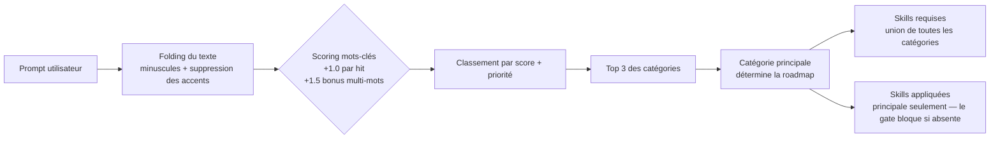
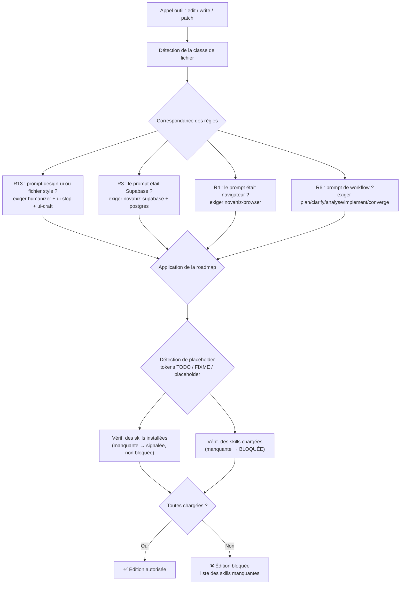
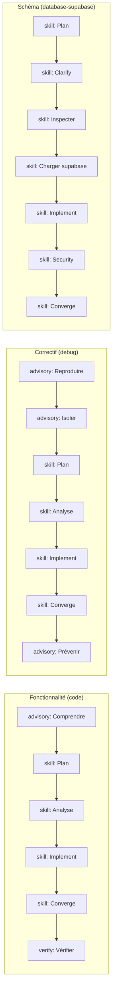
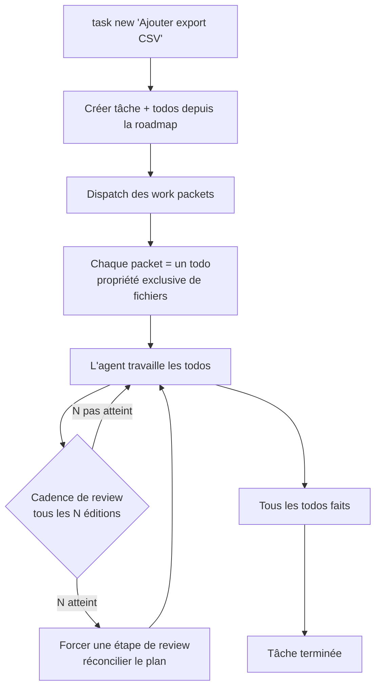

# Novahiz : la boîte à outils de gouvernance des agents

> **Couche d'application sans dépendance pour les agents de code IA** — classe les prompts, attribue des roadmaps d'exécution, bloque les éditions non sûres tant que les bonnes skills ne sont pas chargées, et persiste les décisions d'une session à l'autre — tout cela de façon déterministe, sans appel de modèle.

17 catégories, 96 skills, 11 gate rules, 7 MCP providers — tout déterministe, tout local, tout JSON.

```
┌──────────────────────────────────────────────────────────────────────────┐
│                                                                          │
│   PROMPT UTIL.  ──▶  CLASSIF.  ──▶  GATE  ──▶  SORTIE SÛRE              │
│                                                                          │
│   « Corrige le    3 catégories   2 skills       Édition bloquée          │
│     bug d'auth »  détectées      manquantes     tant que les            │
│                   exigées        skills ne sont pas chargées            │
│                                                                          │
└──────────────────────────────────────────────────────────────────────────┘
```

---

## Comment se déroule une session

1. **Classifier** — chaque prompt est noté contre 17 catégories (mots-clés déterministes, aucun appel de modèle). Le résultat porte jusqu'à trois catégories, une principale, un niveau de confiance, un **tier** (`trivial` / `lite` / `full`), et les skills que le gate attendra.
2. **Roadmap** — la catégorie principale sélectionne une roadmap ordonnée, et le plugin injecte sa checklist dans la session : l'agent suit plan → clarify → tasks → analyse → implement → converge au lieu d'improviser un ordre.
3. **Gate sur chaque écriture** — les appels `edit` / `write` / `patch` / `bash` / `shell` sont vérifiés selon la classe de fichier, les règles actives, les skills de roadmap et le contenu (tokens de placeholder) : **allow** ou **block**, en local, sans appel de modèle dans le chemin de décision.
4. **Gate reload, pas une impasse** — un blocage nomme exactement les skills manquantes et la règle de retry : charger chacune, rejouer l'appel une seule fois. Une skill absente de l'index installé est signalée, jamais appliquée. `NOVAHIZ_GATE=off` est la seule soupape, et elle est bruyante.
5. **Vérifier et converger** — les roadmaps se terminent par des étapes `verify` qui exigent une preuve ; `novahiz-converge` note le code face à la demande d'origine et transforme chaque reste en étape traçable du ledger.
6. **Persister** — décisions, causes racines et prochaines étapes survivent à la session via la couche mémoire (ci-dessous), et `novahiz report` boucle la boucle avec un résumé de session.

```
 PROMPT ─▶ CLASSIFIER ─▶ ROADMAP ─▶ travail ─▶ GATE ─▶ allow ─▶ VERIFY ─▶ MEMORY
                 │                     ▲         │
                 └─ tier, skills ──────│         └─ block : charger les skills nommées, retry une fois
```

**17 catégories**, **96 skills**, **11 gate rules**, **7 MCP providers** — tout déterministe, tout local, tout JSON.

---

## Démarrage rapide

### Option 1 — En une ligne (recommandé)

```bash
npm install -g novahiz
novahiz-install --yes
```

`npm install -g novahiz` installe le CLI. Sur npm 11+, les scripts de lifecycle sont derrière une confirmation allow-scripts : la configuration est donc une seconde étape explicite. `novahiz-install` configure opencode, le seul harness supporté — skills, plugin/agent, commands, MCP servers, config ; `--yes` accepte la configuration détectée. Puis vérifiez :

```bash
novahiz doctor   # Santé : 15 checks (17 avec --deep)
novahiz classify "fix the auth bug"
```

### Option 2 — Depuis les sources

```bash
git clone https://github.com/novahiz/novahiz.git
cd novahiz
npm install            # `prepare` typecheck et build dist/
node ./install/install.mjs   # ajouter --yes pour accepter les valeurs détectées

# Vérifier
node ./dist/cli.js doctor
```

> Nécessite **Node.js >= 22.18**. L'installeur installe automatiquement le CLI d'opencode (`opencode-ai`) s'il est entièrement absent de la machine, sans bloquer.

---

## Le classifier

Chaque prompt utilisateur passe par le classifier. Il note les mots-clés contre 17 catégories et retient les meilleurs matchs.


```mermaid
flowchart LR
    A[Prompt utilisateur] --> B[Folding du texte<br/>minuscules + suppression des accents]
    B --> C{Scoring mots-clés<br/>+1.0 par hit<br/>+1.5 bonus multi-mots}
    C --> D[Classement par score + priorité]
    D --> E[Top 3 des catégories]
    E --> F[Catégorie principale<br/>détermine la roadmap]
    F --> G[Skills requises<br/>union de toutes les catégories]
    F --> H[Skills appliquées<br/>principale seulement — le gate bloque si absente]
```

**Exemple :**

| Prompt | Catégorie principale | Confiance | Skills requises |
|--------|----------------------|-----------|-----------------|
| "fix the auth bug" | `debug` | 0.60 | novahiz-plan, novahiz-analyse, novahiz-implement, novahiz-converge |
| "add a landing page" | `design-ui` | 0.50 | novahiz-humanizer, ui-slop-remover |
| "create supabase migration" | `database-supabase` | 0.60 | novahiz-supabase, novahiz-postgres, novahiz-plan, novahiz-implement |

---

## Le gate

Le gate est le mécanisme d'application. Il inspecte chaque édition de fichier et décide : **allow** ou **block**.


```mermaid
flowchart TD
    A[Appel outil : edit / write / patch] --> B[Détection de la classe de fichier]
    B --> C{Correspondance des règles}
    
    C --> D[R13 : prompt design-ui ou fichier style ?<br/>exiger humanizer + ui-slop + ui-craft]
    C --> F[R3 : le prompt était Supabase ?<br/>exiger novahiz-supabase + postgres]
    C --> G[R4 : le prompt était navigateur ?<br/>exiger novahiz-browser]
    C --> H[R6 : prompt de workflow ?<br/>exiger plan/clarify/analyse/implement/converge]
    
    D --> I{Application de la roadmap}
    F --> I
    G --> I
    H --> I
    
    I --> J{Détection de placeholder<br/>tokens TODO / FIXME / placeholder}
    
    J --> K["Vérif. des skills installées<br/>(manquante → signalée, non bloquée)"]
    J --> L["Vérif. des skills chargées<br/>(manquante → BLOQUÉE)"]
    
    K --> M{Toutes chargées ?}
    L --> M
    
    M -->|Oui| N[✅ Édition autorisée]
    M -->|Non| O[❌ Édition bloquée<br/>liste des skills manquantes]
```

### Classes de fichiers

| Classe | Extensions |
|--------|-----------|
| `code` | `.ts`, `.tsx`, `.js`, `.jsx`, `.py`, `.go`, `.rs`, `.java`, `.kt`, `.swift`, `.php`, `.dart`, `.rb` |
| `design` | `.css`, `.scss`, `.html`, `.vue`, `.svelte`, `.astro` |
| `text` | `.md`, `.txt`, `.rst` |
| `config` | `.json`, `.yaml`, `.yml`, `.toml` |
| `data` | `.csv`, `.sql`, `.db` |

### Règles du gate

| Règle | Se déclenche sur | Exige |
|-------|------------------|-------|
| R3-supabase | Un chemin Supabase ou un prompt Supabase | novahiz-supabase, novahiz-postgres |
| R4-playwright | Une catégorie prompt navigateur, ou un chemin de test navigateur (`**/*.spec.ts`, `**/e2e/**`, `**/playwright/**`, …) | novahiz-browser |
| R6-Novahiz | Un prompt dans une catégorie de workflow | novahiz-plan, -clarify, -analyse, -implement, -converge |
| R7-assessment | Un prompt d'assessment | novahiz-assess-intake, -research, -define, -shape, -decide |
| R8-docs | Une édition sous `novahiz-docs/**/*.md` | novahiz-docs |
| R9-code-review | Un prompt de review ou un fichier de code en review | novahiz-code-review |
| R10-security | Un prompt d'audit ou de sécurité | novahiz-security |
| R11-accessibility | Un prompt design-ui ou audit | novahiz-wcag-audit |
| R12-web-extract | Un prompt de recherche | novahiz-web-extract |
| R13-design-craft | Un prompt design-ui ou un fichier style (css/scss/less/html) | novahiz-humanizer, ui-slop-remover, ui-craft-rules |
| R14-impeccable | Un prompt design-ui ou un fichier style (css/scss/less/html) | impeccable |

`novahiz-humanizer` et `ui-slop-remover` ne sont exigées que sur les tâches de design frontend (R13) ; `impeccable` se charge de la même façon (R14) pour garder les playbooks shape, critique, audit, harden et polish accessibles, et la roadmap design-ui porte une étape de vérification `impeccable detect` déterministe avant ship. `novahiz init` et `novahiz doctor` affichent les fichiers de contexte `PRODUCT.md` / `DESIGN.md` d'impeccable en lignes advisory.

### Gate reload

Un blocage n'est jamais une impasse. Le refus embarque une recette GATE RELOAD : charger chaque skill nommée via le loader, puis rejouer l'appel exact une fois — aucun outil alternatif, aucune écriture shell, aucun contournement d'édition. Si les mêmes skills sont de nouveau signalées manquantes, le chargement n'a pas été enregistré : exécuter `novahiz doctor`, signaler honnêtement, et s'arrêter. La seule dérogation sanctionnée est `NOVAHIZ_GATE=off` (voir Configuration), déclarée à voix haute.

Une skill requise absente de l'index installé n'est jamais appliquée silencieusement : le gate ajoute `required skill not in index, not enforced — run novahiz sync to realign` à ses raisons au lieu de bloquer pour toujours. Un index illisible rend le gate plus strict, jamais plus laxiste.

---

## Roadmaps

Chaque catégorie possède une roadmap d'exécution ordonnée. Le gate applique les étapes `skill` non optionnelles.

### Le pipeline en six étapes

Huit catégories (`code`, `debug`, `browser`, `design-ui`, `database-supabase`, `planning`, `devops`, `data`) partagent un pipeline — et les étapes 1 à 4 n'écrivent aucun fichier d'application : elles produisent un plan et des décisions :

| # | Étape | Skill | Produit |
|---|-------|-------|---------|
| 1 | Plan | `novahiz-plan` | direction, périmètre, ordre des dépendances, stratégie de découpe, risques |
| 2 | Clarify | `novahiz-clarify` | les questions ouvertes, répondues, et les décisions qu'elles figent |
| 3 | Tasks | `novahiz-task` | des tâches atomiques, chacune avec critères d'acceptation et preuve |
| 4 | Analyse | `novahiz-analyse` | les fichiers et symboles qui portent la logique, et les inconnues |
| 5 | Implement | `novahiz-implement` | des incréments qui laissent le système fonctionnel |
| 6 | Converge | `novahiz-converge` | l'écart entre intention et code, en tâches restantes traçables |

Clarify renvoie le travail au plan quand une réponse change l'architecture ; converge le renvoie aux tâches quand il trouve un écart. `flutter` et `expo` gardent les six mêmes étapes et insèrent leurs skills qualité autour d'implement. Le **tier** du classifier filtre la suite : `trivial` n'exécute presque rien, `lite` garde implement et converge, `full` parcourt toute la roadmap. Référence complète : [docs/ROADMAPS.md](docs/ROADMAPS.md).


```mermaid
flowchart LR
    subgraph "Fonctionnalité (code)"
        A1[advisory: Comprendre] --> A2[skill: Plan]
        A2 --> A3[skill: Analyse]
        A3 --> A4[skill: Implement]
        A4 --> A5[skill: Converge]
        A5 --> A6[verify: Vérifier]
    end
    
    subgraph "Correctif (debug)"
        B1[advisory: Reproduire] --> B2[advisory: Isoler]
        B2 --> B3[skill: Plan]
        B3 --> B4[skill: Analyse]
        B4 --> B5[skill: Implement]
        B5 --> B6[skill: Converge]
        B6 --> B7[advisory: Prévenir]
    end
    
    subgraph "Schéma (database-supabase)"
        C1[skill: Plan] --> C2[skill: Clarify]
        C2 --> C3[skill: Inspecter]
        C3 --> C4[skill: Charger supabase]
        C4 --> C5[skill: Implement]
        C5 --> C6[skill: Security]
        C6 --> C7[skill: Converge]
    end
```

| Type d'étape | Ce que ça veut dire | Comportement du gate |
|--------------|---------------------|----------------------|
| `skill` | Charger une skill avant de continuer | **Bloque** si la skill n'est pas chargée |
| `edit` | Modifier le code | Autorisé |
| `verify` | Vérifier que le travail est correct | Advisory |
| `advisory` | Informatif | Ne bloque jamais |

---

## Ledger de tâches

Pour un travail qui dépasse quelques étapes, le ledger conserve le plan dans SQLite plutôt que dans la conversation.


```mermaid
flowchart TD
    A["task new 'Ajouter export CSV'"] --> B[Créer tâche + todos depuis la roadmap]
    B --> C[Dispatch des work packets]
    C --> D[Chaque packet = un todo<br/>propriété exclusive de fichiers]
    D --> E[L'agent travaille les todos]
    E --> F{Cadence de review<br/>tous les N éditions}
    F -->|N atteint| G[Forcer une étape de review<br/>réconcilier le plan]
    F -->|N pas atteint| E
    G --> E
    E --> H[Tous les todos faits]
    H --> I[Tâche terminée]
```

- **Propriété exclusive des fichiers** — deux work packets ne peuvent pas éditer le même fichier
- **Budget d'itération** — chaque todo a un max (par défaut : 12) avant escalade
- **Cadence de review** — review forcée après 3 éditions de fichiers détenus par un todo ou 2 todos complétés (les éditions hors du projet de la tâche ou hors du périmètre d'un todo ne comptent pas)
- **Preuve obligatoire** — les étapes verify exigent une évidence avant complétion
- **Snapshots** — chaque écriture du ledger laisse un point de restauration ; `novahiz snap list / diff / restore` et les tools MCP `snap_log`, `snap_status`, `snap_diff`, `snap_restore` les lisent ou les rétablissent en place, sans jamais remplacer le fichier

---

## Mémoire

La mémoire de session est un système à deux couches : un espace de travail borné et lisible par la machine, et un carnet lisible par l'humain écrit en double.

| Couche | Où | Comportement |
|--------|----|--------------|
| Slots de session | `project-memory/` sous la racine du projet | `index.json` + slots de taille fixe, compact → archive → rotation |
| Carnet | `MEMORY.md` + page Obsidian | double écriture en fin de tâche ; le dossier du vault vient de `_meta/routing.md` |

### Slots de session — `project-memory/`

- Vit sous la racine du projet : `index.json` plus `slots/`, et `novahiz init` le sème avec un slot de base. La racine est résolue une seule fois (`resolveMemoryDir`) : on peut passer la racine du projet **ou** le dossier mémoire lui-même, l'ancien layout (`index.json` + `slots/`) est accepté tel quel, un chemin hors du projet **dégrade** vers la mémoire du projet (`degraded: true`, jamais d'écriture hors workspace) — et chaque réponse `memory_*` écho le `root` réellement utilisé. Verrou pris trop longtemps → mise en file `.pending` rejouée au prochain appel ; slot illisible → exclu avec `warnings`. La mémoire ne bloque jamais la session.
- Slots de taille fixe (**8000 caractères / 200 lignes**) : un slot plein est compacté, archivé, remplacé — mais jamais à l'aveugle : la copie complète part d'abord dans `slots/archive/<id>-precompact-<ts>.md` (réponse `archivedTo`) et les titres `## ` du fold sont démotés en puces pour que le reparse n'avale rien. La mémoire reste bornée **et** intacte quelle que soit la durée du projet.
- Les outils MCP l'opèrent : `memory_init`, `memory_list`, `memory_get` (trace `last_read`, donnée d'entrée du decay), `memory_search` (shortlist via l'index SQLite FTS5 de `novahiz.sqlite` — index **dérivé**, `engine: "fts"`, repli automatique sur le scan fichiers en `engine: "files"` — puis classement IDF existant, scores 0..1 inchangés), `memory_write` (append et rotation), `memory_update`, `memory_archive`, `memory_rebuild` (réindexe depuis le markdown, hors archives, **et** régénère l'index FTS5).
- Hygiène par la CLI, **dry-run par défaut** (`--apply` exécute, GC = archiver, jamais détruire) : `novahiz memory status | clean | prune` — verrous périmés, échecs `.pending`, fragments `.tmp`, doublons inter-slots (Resume + Détails identiques → le plus récent archivé), orphelins/fantômes, archives au-delà de `--retention` (déplacées vers `slots/archive/retention/`, contenu intact) et slots **jamais lus** depuis `--decay` jours ; `--days` compte la dernière *utilisation* (une lecture récente prolonge la vie). Le banc `npm run bench` mesure le chemin : fold sans cache → fold+cache → FTS+cache.
- C'est ici que vont décisions, causes racines et prochaines étapes quand une tâche complexe se termine.
- `novahiz doctor` vérifie à la fois la racine mémoire et les outils mémoire.

### Double écriture — `MEMORY.md` + vault

La skill `novahiz-memory` écrit l'état de clôture d'une tâche à deux endroits à la fois :

| Support | Destination |
|---------|-------------|
| Projet | `MEMORY.md` à la racine — ce qui marche maintenant, ce qui a changé, ce qui reste ouvert |
| Vault | une page Obsidian — dossier choisi **uniquement** par la table de routage `_meta/routing.md` |

Règles : frontmatter obligatoire (title, category, tags, sources, created, updated, summary), `[[wikilinks]]` depuis la taxonomie, et enrichir la page existante au lieu d'en créer une seconde. Routage ambigu → demander, jamais deviner.

---

## Skills installées

Novahiz livre 96 skills couvrant toutes les catégories :

| Catégorie | Skills | Objectif |
|-----------|--------|----------|
| `code` | novahiz-code-review, code-standards, openapi-mcp-server, ... | Qualité du code, patterns, architecture |
| `debug` | novahiz-analyse, ... | Analyse de cause racine |
| `review` | novahiz-code-review, novahiz-delta-review, ... | Review structurée, rayon d'impact |
| `database-supabase` | novahiz-postgres, novahiz-supabase, ... | Schéma, RLS, migrations, optimisation |
| `design-ui` | novahiz-humanizer, ui-slop-remover, ui-craft-rules, apple-ui-audit, ... | UI/UX, hiérarchie visuelle, feel natif |
| `docs-writing` | ... | Prose, copy marketing, dé-IA du texte |
| `browser` | novahiz-browser, browser-session, novahiz-web-extract, ... | Automatisation web, captures, extraction |
| `audit` | novahiz-security, package-risk-audit, llm-threat-review, ... | Sécurité, conformité, vulnérabilités |
| `expo` | expo-overview, expo-router, expo-module, expo-dev-client, ... | Expo / React Native : routes, modules natifs, builds |
| `devops` | eas-workflows, eas-app-stores, novahiz-release, ... | CI/CD, déploiements, releases versionnées |

Lancer `npx novahiz skills --all` pour voir la liste complète.

---

## Providers

Novahiz auto-enregistre les serveurs MCP externes selon la catégorie du prompt :

| Provider | Package | Licence | Catégories |
|----------|---------|---------|------------|
| novahiz-docs | `mcp/novahiz-docs/index.mjs` (local) | Apache-2.0 | code |
| narsil | `narsil-mcp` | MIT OR Apache-2.0 | code, review |
| novahiz | local (`mcp/novahiz-tools`) | Apache-2.0 | code, planning |
| playwright | `@playwright/mcp` | Apache-2.0 | browser, design-ui |
| security | `security-mcp` | MIT | audit |
| cron | `scheduler-mcp` (clone local venv) | MIT | devops |
| dart | `dart mcp-server` (Dart SDK) | BSD-3-Clause | code, debug, design-ui, flutter |

Packs de skills (installés depuis les dépôts officiels, jamais vendorés) : `flutter/agent-plugins` (25 skills), `dart-lang/skills` (15 skills), `expo/skills` (19 skills, le groupe `expo-*` seulement ; les services payants `eas-*` exclus), `pbakaus/impeccable` (1 skill, la skill design upstream `impeccable`). Voir [docs/PROVIDERS.md](docs/PROVIDERS.md).

Dépôts upstream et provenance complète des providers MCP et plugins opencode : [docs/PROVIDERS.md](docs/PROVIDERS.md), [docs/HARNESSES.md](docs/HARNESSES.md), [NOTICE.md](NOTICE.md).

> Note : les fichiers de `docs/` restent en anglais.

---

## Configuration

```bash
# Désactiver le gate (soupape d'urgence)
NOVAHIZ_GATE=off npx opencode

# Surcharger le répertoire home
NOVAHIZ_HOME=/path/to/novahiz npx novahiz doctor

# Forcer la version de node
NOVAHIZ_NODE=/usr/local/bin/node npx novahiz doctor
```

Voir [docs/CONFIGURATION.md](docs/CONFIGURATION.md) pour toutes les options.

---

## Commandes

| Commande | Objectif |
|----------|----------|
| `novahiz init` | Installation en une passe |
| `novahiz doctor` | Diagnostic de santé 15-check (17 avec `--deep`) |
| `novahiz status` | Classification + état du gate actuels |
| `novahiz classify <text>` | Classer un prompt |
| `novahiz gate` | Vérifier si une édition est autorisée |
| `novahiz task new <title>` | Démarrer une tâche suivie |
| `novahiz task status` | Avancement de la tâche |
| `novahiz task done <id>` | Marquer un todo complété |
| `novahiz snap <sub>` | Snapshots versionnés du ledger (`save` / `list` / `diff` / `restore`) |
| `novahiz graph <sub>` | Graphe de code du workspace (`build` / `find` / `trace` / `api` / `map` / `fresh`) — le nôtre, en processus, sans binaire externe ([docs/GRAPH.md](docs/GRAPH.md)) |
| `novahiz memory <sub>` | Hygiène de la mémoire projet (`status` / `clean` / `prune`) — dry-run par défaut, `--apply` pour exécuter ; `prune` archive, rien n'est supprimé |
| `novahiz report` | Rapport de session |
| `novahiz skills` | Lister les skills chargées ou disponibles |
| `novahiz catalog <query>` | Chercher dans le catalogue de skills |
| `novahiz roadmap` | Afficher la roadmap d'exécution |
| `novahiz dispatch` | Générer des work packets |
| `novahiz sync` | Reconstruire l'index des skills installées |
| `novahiz clean` | Supprimer les vieux logs |
| `novahiz upgrade` | Pull du dernier + rebuild |
| `novahiz version` | Afficher la version |

Voir [docs/CLI.md](docs/CLI.md) pour la référence complète.

---

## Documentation

| Fichier | Sujet |
|---------|-------|
| [docs/ARCHITECTURE.md](docs/ARCHITECTURE.md) | Design système, composants, flux de données |
| [docs/CLASSIFICATION.md](docs/CLASSIFICATION.md) | Fonctionnement du classifier |
| [docs/GATE.md](docs/GATE.md) | Règles du gate, classes de fichiers, application |
| [docs/CATALOG.md](docs/CATALOG.md) | Catégories, règles, providers, overrides |
| [docs/PLUGIN.md](docs/PLUGIN.md) | Cycle de vie du plugin opencode |
| [docs/CLI.md](docs/CLI.md) | Référence des commandes CLI |
| [docs/CONFIGURATION.md](docs/CONFIGURATION.md) | Fichiers de config et variables d'env |
| [docs/EXECUTION.md](docs/EXECUTION.md) | Ledger de tâches, todos, dispatch |
| [docs/PROVIDERS.md](docs/PROVIDERS.md) | Serveurs MCP et packs de skills |
| [docs/INSTALL.md](docs/INSTALL.md) | Installation et configuration |
| [docs/ROADMAPS.md](docs/ROADMAPS.md) | Roadmaps d'exécution |
| [docs/RULES.md](docs/RULES.md) | Référence des règles du gate |
| [docs/CONSTITUTION.md](docs/CONSTITUTION.md) | Principes du projet |
| [docs/HARNESSES.md](docs/HARNESSES.md) | Guide des adaptateurs de harness |
| [docs/TOKENS.md](docs/TOKENS.md) | Diagnostics de tokens |

---

## Philosophie

Novahiz traite les skills comme des **serrures** et le prompt comme une **clé**. Le classifier détermine quelles serrures existent. Le gate vérifie que vous avez les bonnes clés chargées. Pas de clé, pas d'édition.

Tout est local, déterministe et JSON. Aucun appel cloud. Aucune inférence de modèle dans le chemin de décision. Même prompt + même config = même résultat, à chaque fois.

---

## Licence

Apache-2.0
