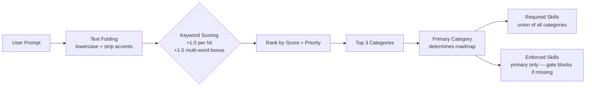
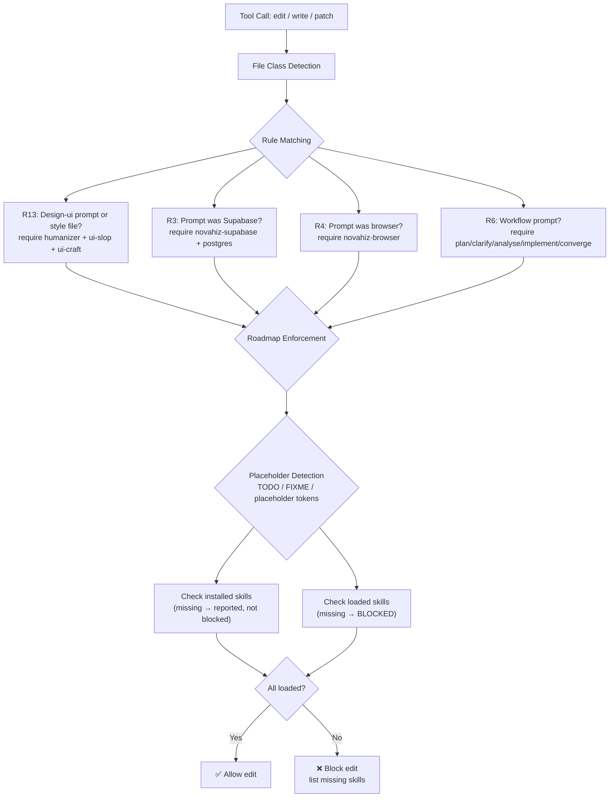
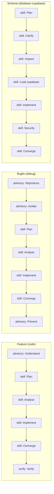
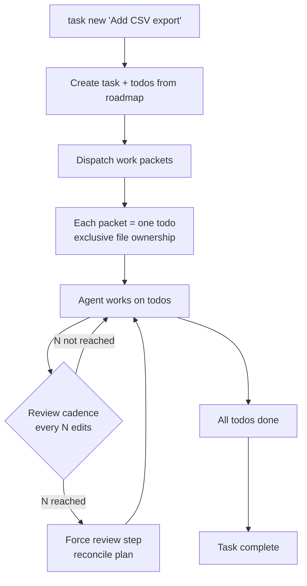

# Novahiz: Agent Governance Toolkit

> **Zero-dependency enforcement layer for AI coding agents** — classifies prompts, assigns execution roadmaps, blocks unsafe edits until the right skills are loaded, and persists decisions across sessions — all deterministically, without model calls.

17 categories, 96 skills, 11 gate rules, 7 MCP providers — all deterministic, all local, all JSON.

```
┌─────────────────────────────────────────────────────────────────────┐
│                                                                     │
│    USER PROMPT  ──▶  CLASSIFIER  ──▶  GATE  ──▶  SAFE OUTPUT      │
│                                                                     │
│    "Fix the      3 categories    2 missing     Edit blocked        │
│     auth bug"    detected         skills        until skills       │
│                                   required      loaded             │
│                                                                     │
└─────────────────────────────────────────────────────────────────────┘
```

---

## How a session runs

1. **Classify** — every prompt is scored against 17 categories (deterministic keyword matching, no model call). The result carries up to three categories, a primary one, a confidence, a **tier** (`trivial` / `lite` / `full`), and the skills the gate will expect.
2. **Roadmap** — the primary category selects an ordered roadmap, and the plugin injects its checklist into the session: the agent walks plan → clarify → tasks → analyse → implement → converge instead of improvising an order.
3. **Gate on every write** — `edit` / `write` / `patch` / `bash` / `shell` calls are checked against file class, active rules, roadmap skills and content (placeholder tokens): **allow** or **block**, locally, with no model call in the decision path.
4. **Auto-repair, not a dead end** — a block names the exact missing skills and the retry rule: load each one, retry the same call once. A skill absent from the installed index is reported, never enforced. `NOVAHIZ_GATE=off` is the only escape hatch, and it is loud.
5. **Verify and converge** — roadmaps end in `verify` steps that require proof; `novahiz-converge` grades the code against the original request and turns every remainder into a traceable ledger step.
6. **Persist** — decisions, root causes and next steps survive the session through the memory layer (below), and `novahiz report` closes the loop with a session summary.

```
 PROMPT ─▶ CLASSIFY ─▶ ROADMAP ─▶ work ─▶ GATE ─▶ allow ─▶ VERIFY ─▶ MEMORY
               │                   ▲        │
               └─ tier, skills ────│        └─ block: load named skills, retry once
```

**17 categories**, **96 skills**, **11 gate rules**, **7 MCP providers** — all deterministic, all local, all JSON.

---

## Quick start

### Option 1 — One-liner (recommended)

```bash
npm install -g novahiz
novahiz-install --yes
```

`npm install -g novahiz` installs the CLI. On npm 11+, lifecycle scripts are gated behind an allow-scripts confirmation, so configuration is an explicit second step: `novahiz-install` asks which harnesses to configure (opencode and Claude Code when their config is present, Codex too; `--yes` accepts the detected defaults, `--harness claude` forces a list) — skills, plugin/agent, hooks, MCP servers, config. Then verify:

```bash
novahiz doctor   # health checks — 13 base, 17 with Claude Code, 19 with impeccable
novahiz classify "fix the auth bug"
```

### Option 2 — From source

```bash
git clone https://github.com/novahiz/novahiz.git
cd novahiz
npm install            # `prepare` typechecks and builds dist/
node ./install/install.mjs   # add --yes to accept the detected defaults

# Verify
node ./dist/cli.js doctor
```

> Requires **Node.js >= 22.18**. The installer auto-installs the CLI of each selected harness when it is entirely missing (`opencode-ai`, `@anthropic-ai/claude-code`, `@openai/codex`), non-blocking.

---

## The Classifier

Every user prompt passes through the classifier. It scores keywords against 17 categories and picks the top matches.


```mermaid
flowchart LR
    A[User Prompt] --> B[Text Folding<br/>lowercase + strip accents]
    B --> C{Keyword Scoring<br/>+1.0 per hit<br/>+1.5 multi-word bonus}
    C --> D[Rank by Score + Priority]
    D --> E[Top 3 Categories]
    E --> F[Primary Category<br/>determines roadmap]
    F --> G[Required Skills<br/>union of all categories]
    F --> H[Enforced Skills<br/>primary only — gate blocks if missing]
```

**Example:**

| Prompt | Top Category | Confidence | Skills Required |
|--------|-------------|------------|-----------------|
| "fix the auth bug" | `debug` | 0.60 | novahiz-plan, novahiz-analyse, novahiz-implement, novahiz-converge |
| "add a landing page" | `design-ui` | 0.50 | novahiz-humanizer, ui-slop-remover |
| "create supabase migration" | `database-supabase` | 0.60 | novahiz-supabase, novahiz-postgres, novahiz-plan, novahiz-implement |

---

## The Gate

The gate is the enforcement mechanism. It inspects every file edit and decides: **allow** or **block**.


```mermaid
flowchart TD
    A[Tool Call: edit / write / patch] --> B[File Class Detection]
    B --> C{Rule Matching}
    
    C --> D[R13: Design-ui prompt or style file?<br/>require humanizer + ui-slop + ui-craft]
    C --> F[R3: Prompt was Supabase?<br/>require novahiz-supabase + postgres]
    C --> G[R4: Prompt was browser?<br/>require novahiz-browser]
    C --> H[R6: Workflow prompt?<br/>require plan/clarify/analyse/implement/converge]
    
    D --> I{Roadmap Enforcement}
    F --> I
    G --> I
    H --> I
    
    I --> J{Placeholder Detection<br/>TODO / FIXME / placeholder tokens}
    
    J --> K["Check installed skills<br/>(missing → reported, not blocked)"]
    J --> L["Check loaded skills<br/>(missing → BLOCKED)"]
    
    K --> M{All loaded?}
    L --> M
    
    M -->|Yes| N[✅ Allow edit]
    M -->|No| O[❌ Block edit<br/>list missing skills]
```

### File classes

| Class | Extensions |
|-------|-----------|
| `code` | `.ts`, `.tsx`, `.js`, `.jsx`, `.py`, `.go`, `.rs`, `.java`, `.kt`, `.swift`, `.php`, `.dart`, `.rb` |
| `design` | `.css`, `.scss`, `.html`, `.vue`, `.svelte`, `.astro` |
| `text` | `.md`, `.txt`, `.rst` |
| `config` | `.json`, `.yaml`, `.yml`, `.toml` |
| `data` | `.csv`, `.sql`, `.db` |

### Gate rules

| Rule | Triggers on | Requires |
|------|-------------|----------|
| R3-supabase | A Supabase path or a Supabase prompt | novahiz-supabase, novahiz-postgres |
| R4-playwright | A browser prompt category, or a browser test path (`**/*.spec.ts`, `**/e2e/**`, `**/playwright/**`, …) | novahiz-browser |
| R6-Novahiz | A prompt in a workflow category | novahiz-plan, -clarify, -analyse, -implement, -converge |
| R7-assessment | An assessment prompt | novahiz-assess-intake, -research, -define, -shape, -decide |
| R8-docs | Edits under `novahiz-docs/**/*.md` | novahiz-docs |
| R9-code-review | A review prompt or a code file under review | novahiz-code-review |
| R10-security | An audit or security prompt | novahiz-security |
| R11-accessibility | A design-ui or audit prompt | novahiz-wcag-audit |
| R12-web-extract | A research prompt | novahiz-web-extract |
| R13-design-craft | A design-ui prompt or a style file (css/scss/less/html) | novahiz-humanizer, ui-slop-remover, ui-craft-rules |
| R14-impeccable | A design-ui prompt or a style file (css/scss/less/html) | impeccable |

`novahiz-humanizer` and `ui-slop-remover` are required only on frontend design tasks (R13); `impeccable` loads the same way (R14) so the shape, critique, audit, harden and polish playbooks stay reachable, and the design-ui roadmap carries a deterministic `impeccable detect` verify step before ship. `novahiz init` and `novahiz doctor` report the impeccable `PRODUCT.md` / `DESIGN.md` context files as advisory rows.

### Auto-repair

A block is never a dead end. The refusal carries an AUTO-REPAIR recipe: load every skill it names with the skill loader, then retry the exact same call once — no alternate tool, no shell write, no editing around it. If the same skills are reported missing again, the load did not register: run `novahiz doctor`, report honestly, and stop. The only sanctioned bypass is `NOVAHIZ_GATE=off` (see Configuration), declared out loud.

A required skill missing from the installed index is never enforced silently: the gate appends `required skill not in index, not enforced — run novahiz sync to realign` to its reasons instead of blocking forever. An unreadable index makes the gate stricter, never laxer.

---

## Roadmaps

Each category has an ordered execution roadmap. The gate enforces non-optional `skill` steps.

### The six-stage pipeline

Eight categories (`code`, `debug`, `browser`, `design-ui`, `database-supabase`, `planning`, `devops`, `data`) share one pipeline — and stages 1–4 write no application file, they produce a plan and decisions:

| # | Stage | Skill | Produces |
|---|-------|-------|----------|
| 1 | Plan | `novahiz-plan` | direction, scope, dependency order, slicing strategy, risks |
| 2 | Clarify | `novahiz-clarify` | the open questions, answered, and the decisions they freeze |
| 3 | Tasks | `novahiz-task` | atomic tasks, each with acceptance criteria and proof |
| 4 | Analyse | `novahiz-analyse` | the files and symbols that carry the logic, and the unknowns |
| 5 | Implement | `novahiz-implement` | increments that leave the system working |
| 6 | Converge | `novahiz-converge` | the gap between intent and code, as traceable remaining tasks |

Clarify sends the work back to plan when an answer changes the architecture; converge sends it back to tasks when it finds a gap. `flutter` and `expo` keep the same six stages and insert their own quality skills around implement. The classifier's **tier** filters the rest: `trivial` runs almost nothing, `lite` keeps implement and converge, `full` walks the whole roadmap. Full reference: [docs/ROADMAPS.md](docs/ROADMAPS.md).


```mermaid
flowchart LR
    subgraph "Feature (code)"
        A1[advisory: Understand] --> A2[skill: Plan]
        A2 --> A3[skill: Analyse]
        A3 --> A4[skill: Implement]
        A4 --> A5[skill: Converge]
        A5 --> A6[verify: Verify]
    end
    
    subgraph "Bugfix (debug)"
        B1[advisory: Reproduce] --> B2[advisory: Isolate]
        B2 --> B3[skill: Plan]
        B3 --> B4[skill: Analyse]
        B4 --> B5[skill: Implement]
        B5 --> B6[skill: Converge]
        B6 --> B7[advisory: Prevent]
    end
    
    subgraph "Schema (database-supabase)"
        C1[skill: Plan] --> C2[skill: Clarify]
        C2 --> C3[skill: Inspect]
        C3 --> C4[skill: Load supabase]
        C4 --> C5[skill: Implement]
        C5 --> C6[skill: Security]
        C6 --> C7[skill: Converge]
    end
```

| Step Kind | What it means | Gate behavior |
|-----------|---------------|---------------|
| `skill` | Load a skill before proceeding | **Blocks** if skill not loaded |
| `edit` | Make code changes | Allowed |
| `verify` | Check the work is correct | Advisory |
| `advisory` | Informational | Never blocks |

---

## Task Ledger

For work that spans more than a few steps, the ledger keeps the plan in SQLite instead of in the conversation.


```mermaid
flowchart TD
    A["task new 'Add CSV export'"] --> B[Create task + todos from roadmap]
    B --> C[Dispatch work packets]
    C --> D[Each packet = one todo<br/>exclusive file ownership]
    D --> E[Agent works on todos]
    E --> F{Review cadence<br/>every N edits}
    F -->|N reached| G[Force review step<br/>reconcile plan]
    F -->|N not reached| E
    G --> E
    E --> H[All todos done]
    H --> I[Task complete]
```

- **Exclusive file ownership** — no two work packets can edit the same file
- **Iteration budget** — each todo has a max (default: 12) before escalation
- **Review cadence** — forced review every 3 edits or 2 completed todos
- **Proof required** — verify steps require evidence before completion

---

## Memory

Session memory is a two-layer system: a bounded, machine-readable workspace, and a human-readable notebook that is dual-written.

| Layer | Where | Behavior |
|-------|-------|----------|
| Session slots | `project-memory/` under the project root | `index.json` + fixed-size slots, compact → archive → rotate |
| Notebook | `MEMORY.md` + Obsidian vault page | dual-write at task end; the vault folder comes from `_meta/routing.md` |

### Session slots — `project-memory/`

- Lives under the project root: `index.json` plus `slots/`, and `novahiz init` seeds it with a baseline slot.
- Slots are fixed-size (**8000 chars / 200 lines**): a full slot is compacted, archived, and replaced — memory stays bounded no matter how long the project runs.
- MCP tools operate it: `memory_init`, `memory_list`, `memory_get`, `memory_write` (appends and rotates), `memory_rebuild` (reindexes from the markdown).
- This is where decisions, root causes and next steps go when a complex task ends.
- `novahiz doctor` checks both the memory root and the memory tools.

### Dual-write — `MEMORY.md` + vault

The `novahiz-memory` skill writes the closing state of a task in two places at once:

| Medium | Destination |
|--------|-------------|
| Project | `MEMORY.md` at the project root — what works now, what changed, what stays open |
| Vault | an Obsidian page — folder chosen **only** by the `_meta/routing.md` routing table |

Rules: mandatory frontmatter (title, category, tags, sources, created, updated, summary), `[[wikilinks]]` from the taxonomy, and enrich the existing page instead of creating a second one. Ambiguous routing → ask, never guess.

---

## Installed skills

Novahiz ships with 96 skills across all categories:

| Category | Skills | Purpose |
|----------|--------|---------|
| `code` | novahiz-code-review, code-standards, openapi-mcp-server, ... | Code quality, patterns, architecture |
| `debug` | novahiz-analyse, ... | Root cause analysis |
| `review` | novahiz-code-review, novahiz-delta-review, ... | Structured review, blast radius |
| `database-supabase` | novahiz-postgres, novahiz-supabase, ... | Schema, RLS, migrations, optimization |
| `design-ui` | novahiz-humanizer, ui-slop-remover, ui-craft-rules, apple-ui-audit, ... | UI/UX, visual hierarchy, native feel |
| `docs-writing` | ... | Prose, marketing copy, AI de-tell |
| `browser` | novahiz-browser, browser-session, novahiz-web-extract, ... | Web automation, screenshots, extraction |
| `audit` | novahiz-security, package-risk-audit, llm-threat-review, ... | Security, compliance, vulnerability |
| `expo` | expo-overview, expo-router, expo-module, expo-dev-client, ... | Expo / React Native: routes, native modules, builds |
| `devops` | eas-workflows, eas-app-stores, novahiz-release, ... | CI/CD, deploys, versioned releases |

Run `npx novahiz skills --all` to see the full list.

---

## Providers

Novahiz auto-registers external MCP servers based on the prompt category:

| Provider | Package | License | Categories |
|----------|---------|---------|------------|
| context7 | `@upstash/context7-mcp` | MIT | code |
| narsil | `narsil-mcp` | MIT OR Apache-2.0 | code, review |
| novahiz | local (`mcp/novahiz-tools`) | Apache-2.0 | code, planning |
| playwright | `@playwright/mcp` | Apache-2.0 | browser, design-ui |
| security | `security-mcp` | MIT | audit |
| cron | `scheduler-mcp` (local venv clone) | MIT | devops |
| dart | `dart mcp-server` (Dart SDK) | BSD-3-Clause | code, debug, design-ui, flutter |

Skill packs (installed from official repos, never vendored): `flutter/agent-plugins` (25 skills), `dart-lang/skills` (15 skills), `expo/skills` (19 skills, the `expo-*` group only; `eas-*` paid services excluded), `pbakaus/impeccable` (1 skill, the upstream `impeccable` design skill). See [docs/PROVIDERS.md](docs/PROVIDERS.md).

Upstream repositories and full provenance for MCP providers and opencode plugins: [docs/PROVIDERS.md](docs/PROVIDERS.md), [docs/HARNESSES.md](docs/HARNESSES.md), [NOTICE.md](NOTICE.md).

---

## Configuration

```bash
# Disable the gate (escape hatch)
NOVAHIZ_GATE=off npx opencode

# Override home directory
NOVAHIZ_HOME=/path/to/novahiz npx novahiz doctor

# Force node version
NOVAHIZ_NODE=/usr/local/bin/node npx novahiz doctor
```

See [docs/CONFIGURATION.md](docs/CONFIGURATION.md) for all options.

---

## Commands

| Command | Purpose |
|---------|---------|
| `novahiz init` | One-shot setup |
| `novahiz doctor` | 13-check health diagnostic (14 with `--deep`; 17 with Claude Code, 19 with impeccable) |
| `novahiz status` | Current classification + gate state |
| `novahiz classify <text>` | Classify a prompt |
| `novahiz gate` | Check if an edit is allowed |
| `novahiz task new <title>` | Start a tracked task |
| `novahiz task status` | Task progress |
| `novahiz task done <id>` | Mark a todo complete |
| `novahiz report` | Session report |
| `novahiz skills` | List loaded or available skills |
| `novahiz catalog <query>` | Search the skill catalog |
| `novahiz roadmap` | Show execution roadmap |
| `novahiz dispatch` | Generate work packets |
| `novahiz sync` | Rebuild installed-skills index |
| `novahiz clean` | Remove old logs |
| `novahiz upgrade` | Pull latest + rebuild |
| `novahiz version` | Print version |

See [docs/CLI.md](docs/CLI.md) for full reference.

---

## Documentation

| File | Topic |
|------|-------|
| [docs/ARCHITECTURE.md](docs/ARCHITECTURE.md) | System design, components, data flow |
| [docs/CLASSIFICATION.md](docs/CLASSIFICATION.md) | How the classifier works |
| [docs/GATE.md](docs/GATE.md) | Gate rules, file classes, enforcement |
| [docs/CATALOG.md](docs/CATALOG.md) | Categories, rules, providers, overrides |
| [docs/PLUGIN.md](docs/PLUGIN.md) | opencode plugin lifecycle |
| [docs/CLI.md](docs/CLI.md) | CLI command reference |
| [docs/CONFIGURATION.md](docs/CONFIGURATION.md) | Config files and env vars |
| [docs/EXECUTION.md](docs/EXECUTION.md) | Task ledger, todos, dispatch |
| [docs/PROVIDERS.md](docs/PROVIDERS.md) | MCP servers and skill packs |
| [docs/INSTALL.md](docs/INSTALL.md) | Installation and setup |
| [docs/ROADMAPS.md](docs/ROADMAPS.md) | Execution roadmaps |
| [docs/RULES.md](docs/RULES.md) | Gate rules reference |
| [docs/CONSTITUTION.md](docs/CONSTITUTION.md) | Project principles |
| [docs/HARNESSES.md](docs/HARNESSES.md) | Harness adapter guide |
| [docs/TOKENS.md](docs/TOKENS.md) | Token diagnostics |

---

## Philosophy

Novahiz treats skills like **locks** and the prompt like a **key**. The classifier determines which locks exist. The gate checks whether you have the right keys loaded. No key, no edit.

Everything is local, deterministic, and JSON. No cloud calls. No model inference in the decision path. Same prompt + same config = same result, every time.

---

## License

Apache-2.0
